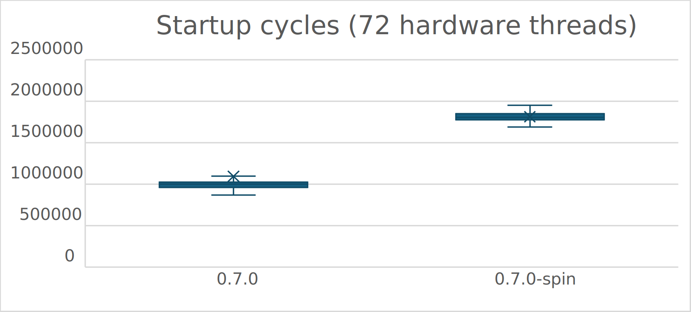

# The Combining Lock

`snmalloc` tries very hard to avoid using locks.
However, there are a few core places where locks are required to manage the global state of the allocator.
These global operations are rare, so the overhead of a lock is not a significant issue.
However, when a thread starts it must acquire this lock to perform its first allocation.
If multiple threads are starting at the same time, then this lock can become contended.

As part of `snmalloc` 0.7, we optimised the lock acquisition for the first allocation.
This optimisation involved a bunch of profiling and simple optimisations.
To further improve the startup time, we introduced a new [_combining lock_](../src/snmalloc/ds/combininglock.h).

The core idea of the combining lock is that it holds a queue of operations that need to be executed while holding the lock,
and then the thread holding the lock can execute multiple threads' operations in a single lock acquisition.
This can reduce the amount of cache misses as a single thread performs multiple updates,
and thus overall the system may have fewer cache misses.

The rest of this document will describe the combining lock in more detail.

## Background: Flat Combining

The core idea behind the combining lock is the flat combining technique of [Hendler et al.](https://dl.acm.org/doi/10.1145/1810479.1810540).
Their paper observes that cache misses in a contended scenario can be extremely costly.
Consider a case where you need to modify a shared data structure, and say that involves writing to several cache lines.
If there are 5 threads contending for the lock, then each thread will have to acquire the lock, and then acquire the caches line in exclusive mode.
This means that it will need to invalidate the exclusive mode cache lines in the previous thread.
These cache misses can result in a significant cost to the system.

Flat combining reduces the number of cache misses in a contended scenario by having threads initially write their operations to a shared queue.
Then a single thread will acquire the lock and execute all the operations in the queue.
This means that the thread holding the lock will have all the cache lines in exclusive mode, and the other threads will only need to invalidate the cache lines of the thread holding the lock.

The flat combining paper goes on to show how to amalgamate the operations in the queue to reduce the amount of work required.
For instance, taking the largest element 5 times from a balanced binary search tree is 5 logarithmic walks of the tree, but it is possible to remove the five smallest elements in a single logarithmic walk.
This can also have significant benefits in throughput.
The combining lock we have built does not amalgamate the operations, just execute them on a single thread.

[Gupta et al.](https://www.usenix.org/conference/osdi23/presentation/gupta) provide OS level support to enable flat combining locks that are transparent to the user.
For `snmalloc`, we have a much simpler use case as we control the code, and so we can make the combining lock explicit in the API.

[Dice el al.](https://dl.acm.org/doi/pdf/10.1145/1989493.1989502) built a flat combining lock that was NUMA aware.
This is a more complex version of the combining lock that we have built that provides additional performance benefits on NUMA systems.

## The API

The API for our combining lock is super simple.  We have one type `CombiningLock` and one function `with`.  The `with` function takes a lambda and executes it while the lock is held.
Once the lambda has completed, `with` will return.
We have mutual exclusion, there is at most one lambda executing at a time on `my_lock`.

```C++
CombiningLock my_lock;
...

with(my_lock, [&] (){
  // Code that needs to be protected by the lock
});
```

The lambda passed to `with` can capture state that needs to be executed while holding the lock.
As the lambda may be executed on a different thread the use of `thread_local` state can be a little tricky.

Let us assume we have a thread local variable `my_state` that we want to update while holding the lock.
```C++
// a global thread local variable.
thread_local int my_state = 0;
```
We can update this variable while holding the lock as follows:
```C++
with(my_lock, [&] (){
  // Code that needs to be protected by the lock
  my_state=8;
});
// One threads my_state is 8, but we aren't guaranteed which thread.
// Hence, the following assert may fail.
assert(my_state == 8);
```
The problem is that the lambda may be executed on a different thread, so the `thread_local` variable `my_state` may not have been updated on the thread that requested it.

We can address this by directly capturing the thread local variable in the lambda.
```C++
with(my_lock, [&my_state] (){
  // Code that needs to be protected by the lock
  my_state=8;
});
```


## Background: MCS Queue Lock

Our implementation of the combining lock is based on the classic [MCS queue lock by Mellor-Crummy and Scott, 1991](https://dl.acm.org/doi/10.1145/103727.103729).
This lock is a simple queue lock that allows threads to spin on a single cache line.

Let us provide an MCS queue lock for our API given above:
```C++
struct LockNode
{
  std::atomic<LockNode*> next{nullptr};
  std::atomic<bool> available{false};
};

struct MCSLock
{
  // End of queue
  std::atomic<LockNode*> last;
};

template<typename F>
inline void with(MCSLock& lock, F&& f)
{
  // Stack allocate our node to use in the queue.
  LockNode node;

  // **************ACQUIRE**************
  // Add ourselves to the end of the queue.
  LockNode* prev = lock.last.exchange(&node, std::memory_order_acq_rel);
  if (prev != nullptr)
  {
    // Add link to previous element in the queue
    prev->next.store(&node, std::memory_order_release);
    // Wait for out turn.
    while (!node.available.load(std::memory_order_acquire))
      ;
  }

  // **************PERFORM**************
  // Run lambda
  f();

  // **************RELEASE**************
  // Check if there is a next thread.
  if (node.next.load(std::memory_order_acquire) == nullptr)
  {
    auto node_address = &node;
    // No next thread so remove ourselves from the end of the queue
    if (lock.last.compare_exchange_strong(node_address, nullptr, std::memory_order_acq_rel))
      return;
    // Wait for next thread to be set as we failed to remove ourselves from the end of the queue.
    while (node.next.load(std::memory_order_acquire) == nullptr)
      ;
  }

  // Wake next thread.
  node.next.load(std::memory_order_acquire)->available.store(true, std::memory_order_release);
}
```
The code can be broken into three parts:
* `ACQUIRE`: Add ourselves to the end of the queue.
* `PERFORM`: Execute the lambda.
* `RELEASE`: Remove ourselves from the queue and wake the next thread.

The `ACQUIRE` part is simple.
We add ourselves to the end of the queue and then wait for the previous thread to set the `available` flag.
If there is no previous thread, then we can immediately execute the lambda.

The `PERFORM` part simply executes the lambda.

The most challenging part of the MCS lock is the release of the lock.
When a thread has finished executing its lambda, it must check if there is another thread waiting to execute.
If there is, it must wake that thread.
If there is no other thread waiting, then it must remove itself from the queue, because a subsequent thread may write to the `next` field of the node that is on the stack.
To unlink this stack allocated node from the queue, we need to use a compare and exchange operation.
This checks if the `last` still points at this node, and if it does, then it sets the `last` to `nullptr`, which signifies that there is no thread waiting to execute.
The awkward case is if the compare and exchange fails.
This means that another thread has joined the queue, but had not set the `next` field when we checked.
In this case, we must wait for the `next` field to be set, and then we can simply notify the next thread to execute.


## The Combining Lock

The combining lock follows the same pattern as the MCS queue lock, but adds a few extra fields to the queue.
Firstly, instead of the status being a boolean for whether the lock is available to this thread.
We have a status that represents three cases:
```C++
enum class LockStatus
{
  WAITING,
  DONE,
  HEAD
};
```
The `WAITING` state is when the thread is waiting for the lock to become available to it.  This roughly corresponds to the `available` field in the MCS queue lock being `false`.
The `HEAD` state is when this thread is responsible for completing more work from the queue. This roughly corresponds to the `available` field in the MCS queue lock being `true`.
The `DONE` state is when another thread has completed the operation (lambda) for this thread. This is a new state that is not present in the MCS queue lock and represents the case where another thread has completed the work for this thread.

The lock node has an extra field that is a function pointer.
This represents the operation that the must be executed for this thread.
```C++
struct CombiningLockNode
{
  std::atomic<CombiningLockNode*> next{nullptr};
  std::atomic<LockStatus> status{WAITING};
  void (*f_raw)(CombiningLockNode*);

  void run()
  {
    f_raw(this);
  }
};
```

The `f_raw` field is a function pointer that is effectively going to do our lambda.

```C++
template<typename F>
struct CombiningLockNodeTempl : CombiningLockNode
{
  F f;

  CombiningLockNodeTempl(F&& f_)
  : CombiningLockNode([](CombiningLockNode* self) {
      auto self_templ = reinterpret_cast<CombiningLockNodeTempl*>(self);
      self_templ->f();
    }), 
    f(f_) {}
};
```
Here we need to use `reinterpret_cast` to convert the `CombiningLockNode*` to the specific instantiation of the `CombiningLockNodeTempl*`.
This is really the virtual dispatch, but we are doing it manually, so as not to incur the overheads of vtables.

We can now provide our new version of the `with` function that uses the combining lock.
```C++
template<typename F>
inline void with(CombiningLock& lock, F&& f)
{
  CombiningLockNodeTempl<F> node(stl::forward<F>(f));

  // **************ACQUIRE**************
  // Add ourselves to the end of the queue.
  CombiningLockNode* prev = lock.last.exchange(&node, std::memory_order_acq_rel);

  if (prev != nullptr)
  {
    // Add link to previous element in the queue
    prev->next.store(&node, std::memory_order_release);
    
    // Wait for our turn.
    while (node.status.load(std::memory_order_relaxed) == LockStatus::WAITING)
      ;

    // Check if another thread completed our work.
    if (node.status.load(std::memory_order_acquire) == LockStatus::DONE)
      return;
  }

  // **************PERFORM**************
  // We are now the head of the queue.
  // Perform work until we hit a nullptr.
  auto curr = this;
  while (true)
  {
    curr->run();

    // Check if there is another operation to execute
    auto next = curr->next.load(std::memory_order_acquire);
    if (next == nullptr)
      break;

    // Notify thread that we completed its work.
    curr->status.store(LockStatus::DONE, std::memory_order_release);
    curr = next;
  }

  // ***********RELEASE**************
  // Attempt to close the queue
  auto curr_address = curr;
  if (lock.last.compare_exchange_strong(curr_address, nullptr, std::memory_order_acq_rel))
  {
    curr->status.store(LockStatus::DONE, std::memory_order_release);
    return;
  }

  // Wait for next thread to be set as we failed to remove
  // ourselves from the end of the queue.
  while (curr->next.load(std::memory_order_relaxed) == nullptr)
    ;

  // Read the next thread
  auto next = curr->next.load(std::memory_order_acquire);

  // Notify the current thread that its work has been completed.
  curr->status.store(LockStatus::DONE, std::memory_order_release);
  // Notify the next thread it is the head of the queue, and should
  // perform operations from the queue.
  next->status.store(LockStatus::HEAD, std::memory_order_release);
  return;
}
```
Again, the code can be broken into three parts.
The `ACQUIRE` part is almost the same as the MCS queue lock.
However, it additionally checks if another thread completed the lambda for this thread.
If this happens, then the thread can return immediately.

The `PERFORM` part is where the executing thread can run the lambdas for itself and many other threads.
It walks the queue executing the lambdas until it reaches a queue node with `next` pointer containing `nullptr`.

The `RELEASE` part attempts to remove the last node from the `PERFORM` phase from the end of the queue.
If this succeeds, then it can simply notify that queue node that its work is `DONE`,
and return.
Otherwise, as with the MCS lock, it must wait for a new thread that is joining the queue to set the `next` pointer.
Then it can notify (`HEAD`) the newly joined thread that it can execute the remaining work.
Finally, it must notify the last element it ran the lambda for that its work is `DONE`.
The `DONE` notification must be done after the read of `next`, as signalling `DONE` can cause the memory for the node to be freed from the stack.

## Full Implementation

The [actual implementation](../src/snmalloc/ds/combininglock.h) in the `snmalloc` codebase is a little more complex as it uses a fast path lock for the uncontended case.
This uses fewer atomic operations in the common case where the lock is not contended,
and is a standard technique for queue locks.

The implementation is also optionally integrated with the OS primitive for waiting such as `futex` or `waitonaddress`.
This means that if enabled, then after spinning for a while the thread will back off to the OS primitive.
This leads to better tail latency in the case where the lock is highly contended.

We observed the OS waiting primitive can be negatively impacted by virtualization. So we provide a flag to disable
the OS waiting primitive. Setting `SNMALLOC_ENABLE_WAIT_ON_ADDRESS` to `OFF` will disable the OS waiting primitive.
The PR adding this feature is [#685](https://github.com/microsoft/snmalloc/pull/685/).

## Performance Results

We have a particularly tough benchmark for testing [lock contention at startup](../src/test/perf/startup/startup.cc).
We used a machine with 72 hardware threads.
The benchmark causes all the threads to synchronise on starting their first allocation.
This means all 72 threads are contending on the lock at the same time to get their allocator initialised.

We ran this benchmark with a standard spin-lock (0.7.0-spin) and with the new combining lock (0.7.0):



As we can see from the benchmark, the combining lock is significantly faster than the spin lock in this highly contented scenario taking only 60% of the time to complete the initialisation.

This benchmark is not at all representative of most scenarios, and is stressing a worst case scenario of the system.

The benchmarking also disabled the OS level support for waiting, so the combining lock is only using spinning.
This was because on a virtualized system the OS level support was slower than spinning.

## Conclusion

The combining lock can be surfaced in C++ with a really simple API that just takes a lambda to execute while holding the lock.
It was really easy to integrate into the `snmalloc` codebase and has provided a significant performance improvement in a highly contended micro-benchmark.
