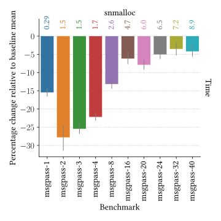
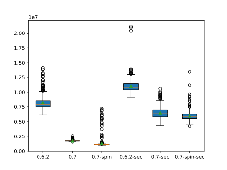

# Release 0.7.0

The latest release of `snmalloc` has a few interesting features that are worth discussing in more detail.
Primarily this release focuses on improving the performance of `snmalloc` in a few key areas.
But we have also added some new features to build new security features on top of `snmalloc`.

## BatchIt

The main addition is the 0.7 release is integrating the `BatchIt` algorithm from the paper

> [BatchIt: Optimizing Message-Passing Allocators for Producer-Consumer Workloads: An Intellectual Abstract](https://dl.acm.org/doi/10.1145/3652024.3665506)
> Nathaniel Wesley Filardo, Matthew J. Parkinson

As the title suggests, the paper considers producer-consumer workloads, wherein producer threads allocate memory for messages that get passed to consumer threads, which free their received messages.
For workloads that do significant amounts of such message passing, the `snmalloc` implementation prior to this release can be sub-optimal.
In particular, the current algorithm can suffer a lot of cache-misses while it handles returning the deallocated messages back to the producer threads' allocators.

BatchIt proposes to add a small consumer- (that is, deallocator-) side cache to allow messages to the same slab of memory to be batched together.
This results in smaller message queues within `snmalloc` and gives much better cache locality when handling messages.

We developed [a micro-benchmark](../../../src/test/perf/msgpass/msgpass.cc) that simulates a producer-consumer workload with back-pressure sending a fixed number of messages per producer.
We then measure the time taken to process all the messages with different numbers of producer and consumer threads.
`msgpass-1` has a single producer and a single consumer, `msgpass-2` has two producers and two consumers, and so on.



The results show a significant potential for improvement in the producer-consumer workload.
As the number of threads increases the cache becomes less effective as each producer can send to all the other consumers,
that is, in the `msgpass-8` case each of the 8 producers can talk to each of the 8 consumers.

The [paper](https://dl.acm.org/doi/10.1145/3652024.3665506) contains a lot more results, we have just given you a taste of the improvement here.

## Start-up performance

Due to a potential customers benchmarking, we observed that `snmalloc` was slower than some other allocators when starting up when there are a lot of threads.
During start-up, we use a lock to ensure that certain tasks are only performed once.
However, when starting a lot of threads, this lock can become a bottleneck.

To address this, we analysed what was doing while holding the lock.
We found that we were doing a several things that were causing more time to be spent inside the lock than was necessary.
Overall, we improve the start-up time of `snmalloc` in high thread scenarios as follows:

We have a particularly tough benchmark for testing [startup time](../../../src/test/perf/startup/startup.cc).
We used a machine with 72 hardware threads.
The benchmark causes all the threads to synchronise on starting their first allocation.
This means all 72 threads are contending on the lock at the same time to get their allocator initialised.
The results are shown in the graph below.



Here 0.6.2 is the last release of snmalloc, and 0.7 is the current release.
We use `spin` to mean that the combining lock is not using OS level waiting, but is spinning instead.
We use `sec` to mean that `snmalloc` has been compiled with the security checks enabled.

The results show that the 0.7 release is significantly faster than the 0.6.2 release.
The improvements are smaller in the `sec` case as there are more interactions with the OS to set up disjoint address spaces for the meta-data and the object-data.
The benchmarks were run on an Azure VM with 72 hardware threads.  Virtualization seems to be costly for the futex system call, so the `spin` version is faster.

The rest of this section details some improvements to get those results.

### Combining Lock

The most interesting feature was the combining lock.
This uses ideas from the Flat Combining work to provide a C++ lock that can be used to reduce the number of cache misses during lock contention.
You can read more about that in [combininglock.md](../../combininglock.md).

### DO_DUMP and DONT_DUMP

To understand what each part of memory is used for, `snmalloc` allocates a pagemap.
This is normally 1/1024 of the address space, and is very sparsely populated.
If we get a core dump while running snmalloc, and the platform does not compress the core dump, then the pagemap can be very large.
To address this, `snmalloc` judiciously uses `madvise` to tell the kernel that it does not need to dump the pagemap.
However, we were also applying this to other structures that were not as large. 

We found that the additional `madvise` calls were taking a noticeable amount of time. 
To address this, we refactored the use to DO_DUMP and DONT_DUMP to only apply to the page map, and not the other smaller overallocations.

See [#665](https://github.com/microsoft/snmalloc/pull/665).

### Lazy initialization of the buddy allocator

The backend of `snmalloc` uses a buddy allocator to manage the large ranges of memory.
This stores power of two sized and aligned blocks of memory, and consolidates them when possible.
To reduce the amount of system calls snmalloc typically requests a large range of memory from the OS.
However, we found that the faulting in the pages for the buddy allocator was taking a noticeable amount of time.
This lead to us refactoring the buddy allocator to lazily initialize the structures it needs, so the number of initial faults is reduced.

See [#665](https://github.com/microsoft/snmalloc/pull/665).

### Miscellaneous

There were other small changes that were made to reduce the number of times the lock had to be held, e.g. [#639](https://github.com/microsoft/snmalloc/pull/639).


## Custom meta-data

We have been designing a new feature in `snmalloc` to build new security features on top of.
The key idea is to allow the allocator to be built with an optional data structure that can be used to store meta-data about every allocation.
In `snmalloc` we have a pagemap that for each 16KiB of memory stores 16 bytes of data.
This stores three things for each chunk of memory:
* The size class of allocations in the chunk of memory;
* The owning allocator of the chunk of memory; and
* A pointer to additional meta-data.

The additional meta-data in snmalloc, is information such as how many allocations are free, and various free-lists for that chunk.
The meta-data can be shared between adjacent chunks of memory, which provides up with variable sized slabs of memory.

The additional meta-data size in snmalloc 0.6 was fixed and under a cache line in most configurations.
In snmalloc 0.7, we have made this meta-data size configurable.
This allows developers to build new security features on top of snmalloc.

For instance, building snmalloc with the following definition of `Config` will allow you to store a 64-bit counter for each allocation:
```cpp
  using Config = snmalloc::StandardConfigClientMeta<
    ArrayClientMetaDataProvider<std::atomic<size_t>>>;
```

This does not affect the underlying alignment of the allocations.
It also only increases the size of the meta-data by the required additional meta-data size.
It does not increase the size of the pagemap.

We have built a simple example inspired by Google's `miracle_ptr`,
that uses this feature to provide the reference counting for all allocations, but out-of-band.
See [miracle_ptr](../../../src/test/func/miracle_ptr/miracle_ptr.cc) for our current experiment.
We are still experimenting with this feature, and would love to hear your feedback.

## Conclusion

The 0.7 release addresses a few awkward performance issues in `snmalloc`, and provides an interesting platform to develop new security features on top of `snmalloc`.
Happy allocating!
