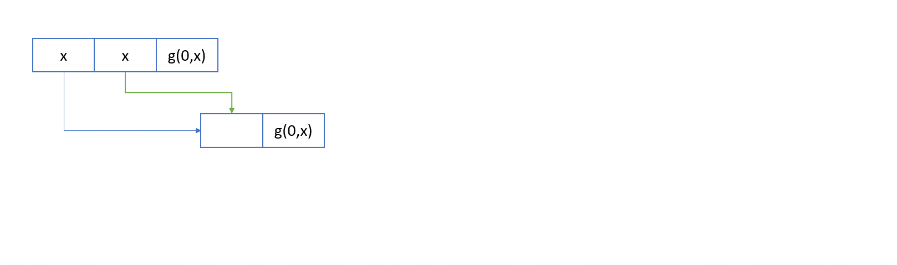

# Protecting meta-data

Corrupting an allocator's meta-data is a common pattern for increasing the power of a use-after-free or out-of-bounds write vulnerabilities.
If you can corrupt the allocator's meta-data, then you can take a control gadget in one part of a system, and use it to affect other parts of the system.
There are various approaches to protecting allocator meta-data, the most common are:

* make the allocator meta-data hard to find through randomisation
* use completely separate ranges of memory for meta-data and allocations
* surround meta-data with guard pages
* add some level of encryption/checksuming

With the refactoring of the page table ([described earlier](./VariableSizedChunks.md)), we can put all the slab meta-data in completely separate regions of memory to the allocations.
We maintain this separation over time, and never allow memory that has been used for allocations to become meta-data and vice versa.
Within the meta-data regions, we add randomisation to make the data hard to find, and add large guard regions around the meta-data.
By using completely separate regions of memory for allocations and meta-data we ensure that no dangling allocation can refer to current meta-data.
This is particularly important for CHERI as it means a UAF can be used to corrupt allocator meta-data.

But there is one super important bit that still remains: free lists.

##  What are free lists?

Many allocators chain together unused allocations into a linked list.
This is remarkably space efficient, as it doesn't require meta-data proportional to the number of allocations on a slab.
The disused objects can be used in either a linked stack or queue.
However, the key problem is neither randomisation or guard pages can be used to protect this _in-band_ meta-data.

In snmalloc, we have introduced a novel technique for protecting this data.

## Protecting a free queue.

The idea is remarkably simple: a doubly linked list is far harder to corrupt than a single linked list, because you can check its invariant:
```
   x.next.prev == x
```
In every kind of free list in snmalloc, we encode both the forward and backward pointers in our lists.
For the forward direction, we use an [involution](https://en.wikipedia.org/wiki/Involution_(mathematics)), `f`, such as XORing a randomly choosen value:
```
  f(a) = a XOR k0
```
For the backward direction, we use a more complex, two-argument function
```
  g(a, b) = (a XOR k1) * (b XOR k2)
```
where `k1` and `k2` are two randomly chosen 64 bit values.
The encoded back pointer of the node after `x` in the list is `g(x, f(x.next))`, which gives a value that is hard to forge and still encodes the back edge relationship.

As we build the list, we add this value to the disused object, and when we consume the free list later, we check the value is correct.
Importantly, the order of construction and consumption have to be the same, which means we can only use queues, and not stacks.

The checks give us a way to detect that the list has not been corrupted.
In particular, use-after-free or out-of-bounds writes to either the `next` or `prev` value are highly likely to be detected later.

## Double free protection

This encoding also provides a great double free protection.
If you free twice, it will corrupt the `prev` pointer, and thus when we come to reallocate that object later, we will detect the double free.
The following animation shows the effect of a double free:



This is a weak protection as it is lazy, in that only when the object is reused will snmalloc raise an error, so a `malloc` can fail due to double free, but we are only aiming to make exploits harder; this is not a bug finding tool.


## Where do we use this?

Everywhere we link disused objects, so (1) per-slab free queues and (2) per-allocator message queues for returning freed allocations to other threads.
Originally, snmalloc used queues for returning memory to other threads.
We had to refactor the per slab free lists to be queues rather than stacks, but that is fairly straightforward.
The code for the free lists can be found here:

[Code](https://github.com/microsoft/snmalloc/blob/main/src/snmalloc/mem/freelist.h)

The idea could easily be applied to other allocators, and we're happy to discuss this.

## Finished assembly

So let's look at what costs we incur from this.
There are bits that are added to both creating the queues, and taking elements from the queues.
Here we show the assembly for taking from a per-slab free list, which is integrated into the fast path of allocation:
```x86asm
<malloc(unsigned long)>:
    lea    rax,[rdi-0x1]                       # Check for small size class
    cmp    rax,0xdfff                          # | zero is considered a large size
    ja     SLOW_SIZE                           # | to remove from fast path.
    shr    rax,0x4                             # Lookup size class in table
    lea    rcx,[size_table]                    # | 
    movzx  edx,BYTE PTR [rax+rcx*1]            # | 
    mov    rdi,rdx                             #+Caclulate index into free lists
    shl    rdi,0x4                             #+| (without checks this is a shift by
                                               # |  0x3, and can be fused into an lea)
    mov    r8,QWORD PTR [rip+0xab9b]           # Find thread local allocator state
    mov    rcx,QWORD PTR fs:0x0                # |
    add    rcx,r8                              # |
    add    rcx,rdi                             # Load head of free list for size class
    mov    rax,QWORD PTR fs:[r8+rdi*1]         # |
    test   rax,rax                             # Check if free list is empty
    je     SLOW_PATH_REFILL                    # |
    mov    rsi,QWORD PTR fs:0x0                # Calculate location of free list structure
    add    rsi,r8                              # | rsi = fs:[r8]
    mov    rdx,QWORD PTR fs:[r8+0x2e8]         #+Load next pointer key
    xor    rdx,QWORD PTR [rax]                 # Load next pointer
    prefetcht0 BYTE PTR [rdx]                  # Prefetch next object
    mov    QWORD PTR [rcx],rdx                 # Update head of free list
    mov    rcx,QWORD PTR [rax+0x8]             #+Check signed_prev value is correct
    cmp    rcx,QWORD PTR fs:[r8+rdi*1+0x8]     #+|
    jne    CORRUPTION_ERROR                    #+|
    lea    rcx,[rdi+rsi*1]                     #+Calculate signed_prev location
    add    rcx,0x8                             #+|  rcx = fs:[r8+rdi*1+0x8]
    mov    rsi,QWORD PTR fs:[r8+0x2d8]         #+Calculate next signed_prev value
    add    rsi,rax                             #+|
    add    rdx,QWORD PTR fs:[r8+0x2e0]         #+|
    imul   rdx,rsi                             #+|
    mov    QWORD PTR [rcx],rdx                 #+Store signed_prev for next entry.
    ret
```
The extra instructions specific to handling the checks are marked with `+`.
As you can see the fast path is about twice the length of the fast path without protection, but only adds a single branch to the fast path, one multiplication, five additional loads, and one store.
The loads only involve one additional cache line for key material.
Overall, the cost is surprisingly low.

Note: the free list header now contains the value that `prev` should contain, which leads to slightly worse x86 codegen.
For instance the checks introduce `shl rdi,0x4`, which was previously fused with an `lea` instruction without the checks.

## Conclusion

This approach provides a strong defense against corruption of the free lists used in snmalloc.
This means all inline meta-data has corruption detection.
The check is remarkably simple for building double free detection, and has far lower memory overhead compared to using an allocation bitmap.

[Next we show how to randomise the layout of memory in snmalloc, and thus make it harder to guess relative address of a pair of allocations.](./Randomisation.md)
