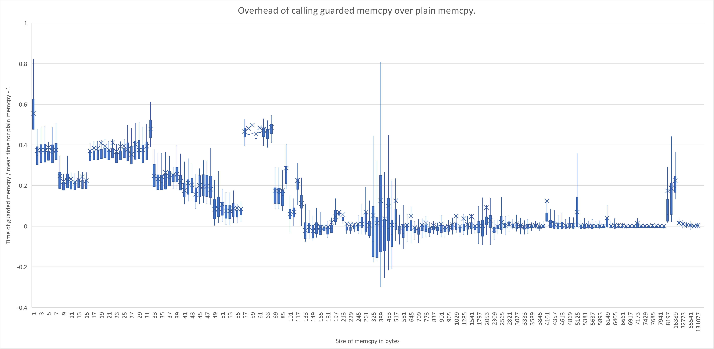
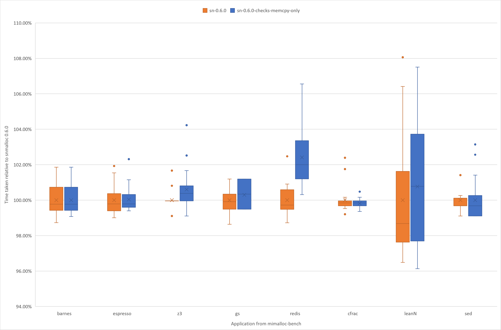

# Providing a guarded memcpy

Out of bounds errors are a serious problem for systems.
We did some analysis of the Microsoft Security Response Center data to look at the out-of-bounds heap corruption, and found a common culprit: `memcpy`.
Of the OOB writes that were categorised as leading to remote code execution (RCE), 1/3 of them had a block copy operation like memcpy as the initial source of corruption.
This makes any mitigation to `memcpy` extremely high-value.

Now, if a `memcpy` crosses a boundary of a `malloc` allocation, then we have a well-defined error in the semantics of the program.
No sensible program should do this.
So let's see how we detect this with snmalloc.


## What is `memcpy`?

So `memcpy(dst, src, len)` copies `len` bytes from `src` to `dst`.
For this to be valid, we can check: 
```C++
  if (src is managed by snmalloc)
    check(remaining_bytes(src) >= len);
  if (dst is managed by snmalloc)
    check(remaining_bytes(dst) >= len);
```
Now, the first `if` is checking for reading beyond the end of the object, and the second is checking for writing beyond the end of the destination object.
By default, for release checks we only check the `dst` is big enough.


##  How can we implement `remaining_bytes`?

In the previous [page](./VariableSizedChunks.md), we discussed how we enable variable sized slabs.
Let's consider how that representation enables us to quickly find the start/end of any object.

All slab sizes are powers of two, and a given slab's lowest address will be naturally aligned for the slab's size.
(For brevity, slabs are sometimes said to be "naturally aligned (at) powers of two".)
That is if `x` is the start of a slab of size `2^n`, then `x % (2^n) == 0`.
This means that a single mask can be used to find the offset into a slab.
As the objects are layed out continguously, we can also get the offset in the object with a modulus operations, that is, `remaining_bytes(p)` is effectively:
```C++
    object_size - ((p % slab_size) % object_size)
```

Well, as anyone will tell you, division/modulus on a fast path is a non-starter.
The first modulus is easy to deal with, we can replace `% slab_size` with a bit-wise mask.
However, as `object_size` can be non-power-of-two values, we need to work a little harder.

##  Reciprocal division to the rescue

When you have a finite domain, you can lower divisions into a multiply and shift.
By pre-calculating `c = (((2^n) - 1)/size) + 1`, the division `x / size` can instead be computed by
```C++
  (x * c) >> n
```
The choice of `n` has to be done carefully for the possible values of `x`, but with a large enough `n` we can make this work for all slab offsets and sizes.

Now from division, we can calculate the modulus, by multiplying the result of the division
by the size, and then subtracting the result from the original value:
```C++
  x - (((x * c) >> n) * size)
```
and thus `remaining_bytes(x)` is:
```
  (((x * c) >> n) * size) + size - x
```

There is a great article that explains this in more detail by [Daniel Lemire](https://lemire.me/blog/2019/02/20/more-fun-with-fast-remainders-when-the-divisor-is-a-constant/).

Making sure you have everything correct is tricky, but thankfully computers are fast enough to check all possilities.
In snmalloc, we have a test program that verifies, for all possible slab offsets and all object sizes, that our optimised result is equivalent to the original modulus.

We build the set of constants per sizeclass using `constexpr`, which enables us to determine the end of an object in a handful of instructions.

## Non-snmalloc memory.

The `memcpy` function is not just called on memory that is received from `malloc`.
This means we need our lookup to work on all memory, and in the case where it is not managed by `snmalloc` to assume it is correct.
We ensure that the `0` value in the chunk map is interpreted as an object covering the whole of the address space.
This works for compatibility.

To achieve this nicely, we map 0 to a slab that covers the whole of address space, and consider there to be single object in this space.
This works by setting the reciprocal constant to 0, and then the division term is always zero.

There is a second complication: `memcpy` can be called before `snmalloc` has been initialised.
So we need a check for this case.

## Finished Assembly

The finished assembly for checking the destination length in `memcpy` is:

```asm
<memcpy_guarded>:
    mov    rax,QWORD PTR [rip+0xbfa]        # Load Chunk map base
    test   rax,rax                          # Check if chunk map is initialised
    je     DONE                             #  |
    mov    rcx,rdi                          # Get chunk map entry
    shr    rcx,0xa                          #  |
    and    rcx,0xfffffffffffffff0           #  |
    mov    rax,QWORD PTR [rax+rcx*1+0x8]    # Load sizeclass
    and    eax,0x7f                         #  |
    shl    rax,0x5                          #  |
    lea    r8,[sizeclass_meta_data]         #  |
    mov    rcx,QWORD PTR [rax+r8*1]         # Load object size
    mov    r9,QWORD PTR [rax+r8*1+0x8]      # Load slab mask
    and    r9,rdi                           # Offset within slab
    mov    rax,QWORD PTR [rax+r8*1+0x10]    # Load modulus constant
    imul   rax,r9                           # Perform recripocal modulus
    shr    rax,0x36                         #  |
    imul   rax,rcx                          #  |
    sub    rcx,r9                           # Find distance to end of object.
    add    rcx,rax                          #  |
    cmp    rax,rdx                          # Compare to length of memcpy.
    jb     ERROR                            #  |
DONE:
    jmp    <memcpy>
ERROR:
    ud2                                     # Trap
```

## Performance

We measured the overhead of adding checks to various sizes of `memcpy`s.
We did a batch of 1000 `memcpy`s, and measured the time with and without checks.
The benchmark code can be found here: [Benchmark Code](../../src/test/perf/memcpy/)



As you can see, the overhead for small copies can be significant (60% on a single byte `memcpy`), but the overhead rapidly drops and is mostly in the noise once you hit 128 bytes.

When we actually apply this to more realistic examples, we can see a small overhead, which for many examples is not significant.
We compared snmalloc (`libsnmallocshim.so`) to snmalloc with just the checks enabled for bounds of the destination of the `memcpy` (`libsnmallocshim-checks-memcpy-only`) on the applications contained in mimalloc-bench.
The results of this comparison are in the following graph:



The worst regression is for `redis` with a 2-3% regression relative to snmalloc running without memcpy checks.
However, given that we this benchmark runs 20% faster than jemalloc, we believe the feature is able to be switched on for production workloads.

## Conclusion

We have an efficient check we can add to any block memory operation to prevent corruption.
The cost on small allocations will be higher due to the number of arithmetic instructions, but as the objects grow the overhead diminishes.
The memory overhead for adding checks is almost zero as all the dynamic meta-data was already required by snmalloc to understand the memory layout, and the small cost for lookup tables in the binary is negligible.

The idea can easily be applied to other block operations in libc, we have just done `memcpy` as a proof of concept.
If the feature is tightly coupled with libc, then an initialisation check could also be removed improving the performance.

[Next, we look at how to defend the internal structures of snmalloc against corruption due to memory safety violations.](./FreelistProtection.md)


# Thanks

The research behind this has involved a lot of discussions with a lot of people.
We are particularly grateful to Andrew Paverd, Joe Bialek, Matt Miller, Mike Macelletti, Rohit Mothe, Saar Amar and Swamy Nagaraju for countless discussions on guarded memcpy, its possible implementations and applications.
