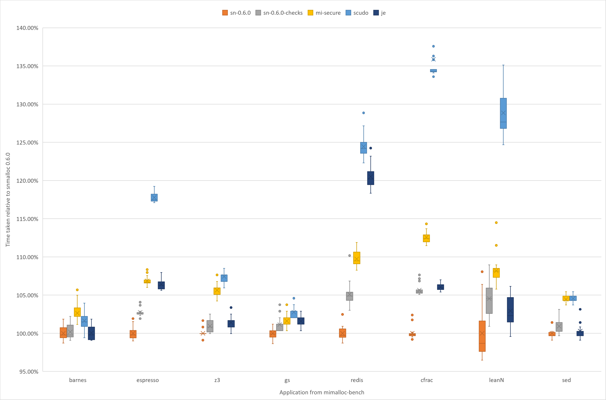

# Hardening snmalloc

The key focus of the 0.6.0 release of snmalloc is security.
This was inspired by a few different things coming together.

First, we had been discussing with the Microsoft Security Response various research on allocator hardening.
Saar Amar had been categorising exploits and what features an allocator should have.
As part of this, we both realised the existing structures of snmalloc made certain things hard to harden, but more interesting we had some ideas for stuff that could advance the state of the art.

Secondly, we had been experimenting with adding support to snmalloc for [CHERI](http://www.chericpu.org).
This support illustrated many places where snmalloc (like most allocators) does pointer tricks that go against the grain of CHERI.
There were refactorings that would make CHERI support much more natural, but those refactorings were quite involved.
Fortunately, they were the very refactorings we needed for the other allocator hardening research we wanted to conduct.

The core aim of our refactoring for 0.6.0 is to provide hardening that can be switched on all the time even in allocation heavy work loads.
We have been super keen to keep fast paths fast, and not lose the awesome performance.
Here we illustrate the performance using the application benchmarks from mimalloc-bench:



The primary comparison point in the graphs is to show the introduced overheads of the checks by comparing `sn-0.6.0` with `sn-0.6.0-checks`.
Here you can see the switching the hardening on leads to regressions under 5%. This is running on a 72-core VM in Azure with each run benchmark repeated 20 times.

We have also included a few other allocators.
Firstly, [jemalloc](https://github.com/jemalloc/jemalloc) v5.2.1 (labelled `je`) as a baseline for a world-class allocator, and two secure allocators [mimalloc](https://github.com/microsoft/mimalloc) v1.7.6 with its security features enabled (labelled mi-secure), and [SCUDO](https://www.llvm.org/docs/ScudoHardenedAllocator.html) (Commit hash bf0bcd5e, labelled `scudo`).
The precise hardening features in these allocators is different to snmalloc, hence the performance is not directly comparable.
We present them to show the hardenings snmalloc hit a lower performance penalty.

To really understand the performance security trade-off, you need to understand the hardening features we have implemented. We have a series of short explanations to explain these mechanisms, and what protections we get:

* [Enabling variable sized slabs](./VariableSizedChunks.md)
* [Enabling guarded `memcpy`](./GuardedMemcpy.md)
* [Protecting free lists from user corruption](./FreelistProtection.md)
* [Randomisation of allocations](./Randomisation.md)

To try out the hardening features of snmalloc on Elf platforms (e.g. Linux, BSD) you can simply [build](../BUILDING.md) and then preload with:
```
LD_PRELOAD=[snmalloc_build]/libsnmalloc-checks.so ./my_app
```
