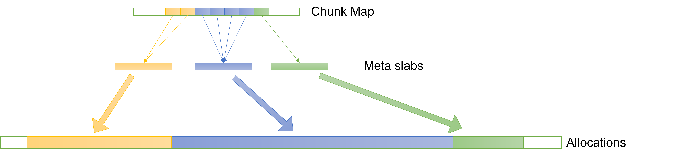

# Supporting variable sized slabs

Before we explain the hardening features, we need to give a bit of background on how snmalloc is structured.
In snmalloc, we have effectively two layers of allocation:

1) an underlying allocator that returns power-of-two sized, naturally aligned blocks of memory, called chunks
2) a slab allocator layered on top of the chunk allocator

Large allocations are served directly by the chunk allocator and small allocations through slabs.

## What is a slab?

A slab is a naturally aligned, power-of-two sized chunk split into a series of allocations of exactly the same size.
For instance, a 16KiB slab could be split into 341 48-byte allocations with 16 bytes that are unused at the end.

## What size should a slab be?

Finding a new slab is inherently going to be a slower path than just allocating an object.
So we want a slab size that means all our common allocations can fit multiple times onto a slab.
But making larger slabs means that we can potentially waste a lot of space for small allocations.

In our redesign of snmalloc, we allow multiple slab sizes so that we can ensure a minimum number of allocations on a slab.
The rest of the article will describe how we achieve this, while efficiently accessing the meta-data associated to a slab.

## Finding meta-data quickly

Allocators must map allocations to associated meta-data.
There are two common approaches for locating this associated meta-data:

* At some specified aligned position relative to a current pointer
* In a global map

Most allocators use some combination of both.
In the original snmalloc design we had a concept of superslab, where the first part represented the meta-data for all the slabs contained in the superslab.
A superslab was initially 16MiB, with the first 64KiB treated specially as it contained meta-data.
There was then a global map to specify if memory was a superslab or not, that global map kept a byte per 16MiB of address space.

This worked well for fixed sizes of slabs, but the granularity was hard coded.

## Chunk map representation

In snmalloc 0.6.0, we are using a two-level global map.
The top-level entries each contain two pointers (with other fields and flags bit-packed into known-zero bits).
For a region of memory being used as a slab, its top-level entry contains

* sizeclass of memory in the chunk (it may be either part of a large allocation, or a slab of small allocations)
* which allocator is responsible for this memory
* a pointer to the associated second-level entry of the map.
  A given second level entry may be pointed to by each of a contiguous span of one or more top-level entries.

This representation allows multiple 16KiB chunks of memory to have the same meta-data.
For instance:



This illustrates how a 32KiB slab, a 64KiB slab, and a 16KiB slab would be represented.
The first (yellow) has two contiguous entries in the chunk map, and the second (blue) has four contiguous entries in the chunk map, and the final (green) has a single entry in the chunk map.

This representation means we can find the meta-data for any slab in a handful of instructions.
(Unlike the original design, this does not need any branching on the particular size of the slab.)

```C++
  SlabMetadata* get_slab_metadata(address_t addr)
  {
    return chunk_map[addr >> CHUNK_BITS].meta;
  }
```

By having a shared `SlabMetadata` across all the entries for the slab, we can have a single free list that covers the whole slab.
This is quite important as it means our fast path for deallocation can handle deallocations for multiple slab sizes without branching, while having the granularity that particular size requires.

The following annotated asm snippet covers the fast path for deallocation:
```x86asm
<free(void*)>:
    mov    rax,rdi
    mov    rcx,QWORD PTR [rip+0x99a6]        # TLS OFFSET for allocator
    mov    rdx,QWORD PTR [rip+0x6df7]        # Chunk Map root
    shr    rdi,0xa                           # Calculate chunk map entry
    and    rdi,0xfffffffffffffff0            #  |
    lea    rsi,[rdx+rdi*1]                   #  |
    mov    rdx,QWORD PTR [rdx+rdi*1+0x8]     # Load owning allocator
    mov    rdi,rdx                           #  |
    and    rdi,0xffffffffffffff80            #  |
    cmp    QWORD PTR fs:[rcx+0x1a0],rdi      # Check if allocator is current one
    jne    REMOTE_DEALLOCATION               # Slow path remote deallocation
    mov    rdx,QWORD PTR [rsi]               # Get SlabMetadata
    mov    rdi,QWORD PTR [rdx+0x18]          # Add to free list
    mov    QWORD PTR [rdi],rax               #  |
    mov    QWORD PTR [rdx+0x18],rax          #  |
    add    WORD PTR [rdx+0x28],0xffff        # Decrement count to slow path
    je     SLOW_PATH                         # Check if more complex slab management is required.
    ret
```

As you can see this representation gives a very compact code sequence for deallocation that handles multiple slab sizes.
It also means the majority of meta-data can be stored away from the memory space it is describing.
[Next, we discuss how we can capitalise on this meta-data representation to provide an efficient checked memcpy.](./GuardedMemcpy.md)
